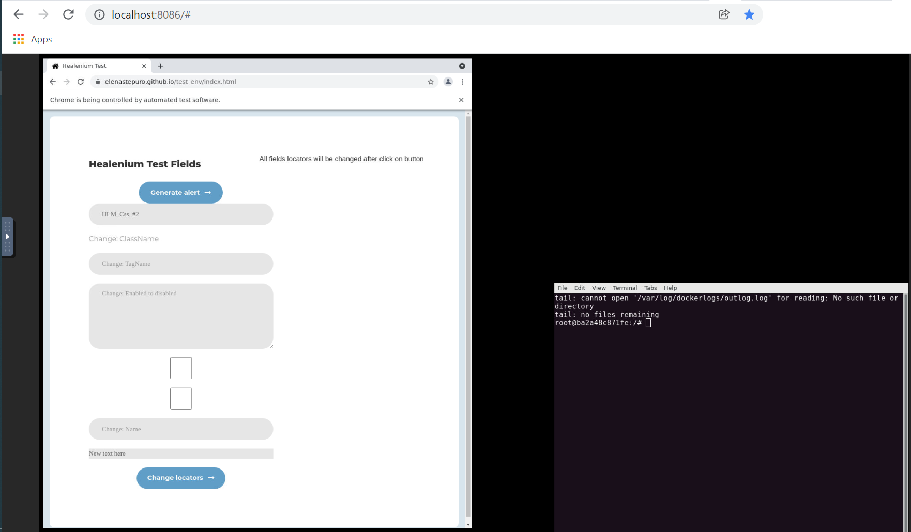

# JavaScript Example with Healenium
This repository contains automation tests on JavaScript using Healenium.

## How to start
### 1. Start Healenium Proxy from infra folder

```cd infra```

```docker-compose up -d```

Verify the next images are up and running:
* ```healenium/hlm-proxy:0.2.1```
* ```healenium/hlm-backend:3.2.0```
* ```healenium/hlm-selenium-3-standalone-tigervnc:0.1.1```
* ```healenium/hlm-selector-imitator:1```
* ```postgres:11-alpine```

### 2. Project structure

    |__root folder
        |__infra
            |__db
                |__init.sql
            |__docker-compose.yaml
        |__src
            |__com.epam.healenium
                |__selenium
                    |__page object
                        |__test_env
                            |__test_env_page.js
                        |__base_page.js
                        |__callback_page.js
                    |__strategy
                        |__locators_type.js
                        |__strategy.js
        |__tests
            |__com.epam.healenium
                |__jasmine
                    |__css_test.mjs
                    |__semantic-locators_test.mjs
                    |__xpath_test.mjs

### 3. Create RemoteWebDriver for Healenium-Proxy
To run using Healenium create RemoteWebDriver with URL ```http://<remote webdriver host>:8085```:

`let opts = new chrome.Options();
opts.addArguments('no-sandbox')
driver = await new webdriver.Builder()
.withCapabilities(webdriver.Capabilities.chrome())
.usingServer('http://localhost:8085')
.setChromeOptions(opts)
.build();`


### 4. Run tests using Jasmine
Add Jasmine to your package.json

`npm install --save-dev jasmine`

Initialize Jasmine in your project

`npx jasmine init`

Set jasmine as your test script in your package.json

`"scripts": { "test": "jasmine" }`

Run your tests

`npm test`

### 5. Monitoring results
You can monitor tests running. To do this go to ```http://<remote webdriver host>:8086```

